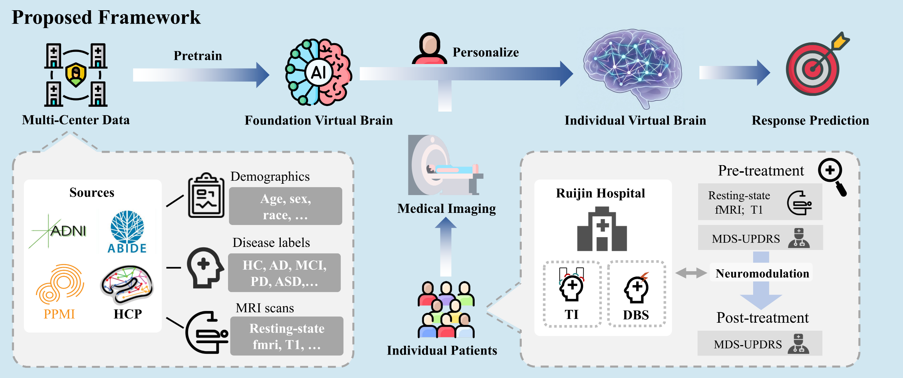
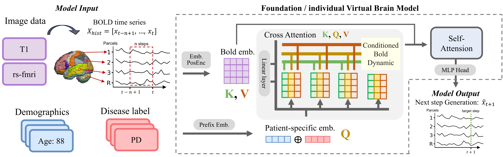
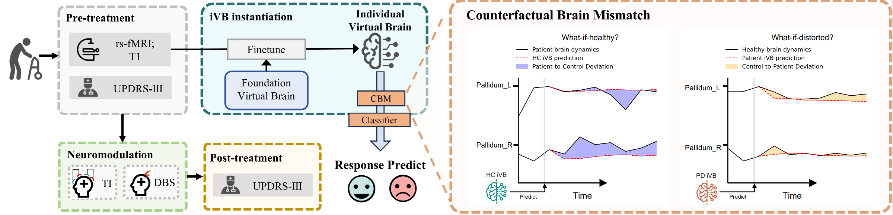

# Predicting Neuromodulation Outcome for Parkinson’s Disease with Generative Virtual Brain Model

A preliminary code implementation for the paper "Predicting Neuromodulation Outcome for Parkinson’s Disease with Generative Virtual Brain Model".

## 📖 Overview

This repository contains the source code, pre-trained models, and data processing pipelines described in our work. Our proposed framework leverages generative modeling to bridge the gap between large-scale neuroimaging data and limited clinical samples, enabling precise prediction of neuromodulation outcomes.

#### 1. Framework Overview
Overview of the proposed framework: a generative virtual brain paradigm transfers dynamical priors from large-scale data to small clinical cohorts for individualized neuromodulation response prediction.



#### 2. Model Architecture
Architecture of the generative virtual brain model.


#### 3. Workflow & Counterfactual Analysis
Schematic illustration of the iVB-based workflow for predicting neuromodulation response and diagram depicting the calculation of the Counterfactual Brain Mismatch.



## 🛠 Installation

To set up the environment, please follow these steps:

1. Clone this repository:
   ```bash
   git clone git@github.com:desomeboy/Foundation-Individual-Generative-Virtual-Brain.git
   cd FVB2iVB
   ```
2. set the environment:
   ```bash
   conda create -n vtb python=3.9 -y 
   conda activate vtb
   pip install -r requirements.txt
   ```

## 📊 Datasets

### Public Data Sources
| Dataset | Content | Access |
|---------|---------|--------|
| **ADNI / ABIDE / PPMI** | Multimodal neuroimaging & clinical data | [IDA/LONI](https://ida.loni.usc.edu) |
| **HCP Young Adult** | 1,200 healthy subjects resting-state fMRI | [HCP Portal](https://www.humanconnectome.org/study/hcp-young-adult/document/1200-subjects-data-release) |
| **AAL3 Atlas** | 166-ROI brain parcellation | [AAL3](https://www.gin.cnrs.fr/en/tools/aal/) |

> Access to ADNI/ABIDE/PPMI requires registration via IDA.

### Preprocessing & Labels
- **Preprocessing code**: All pipelines (motion correction, normalization, AAL3 parcellation) are implemented in [`Data_process/`](https://github.com/desomeboy/Foundation-Individual-Generative-Virtual-Brain/tree/main/Data_process).
- **Subject labels**: Subject IDs and clinical outcomes are stored in [`Data_process/Data_label.csv`](https://github.com/desomeboy/Foundation-Individual-Generative-Virtual-Brain/blob/main/Data_process/Data_label.csv).
