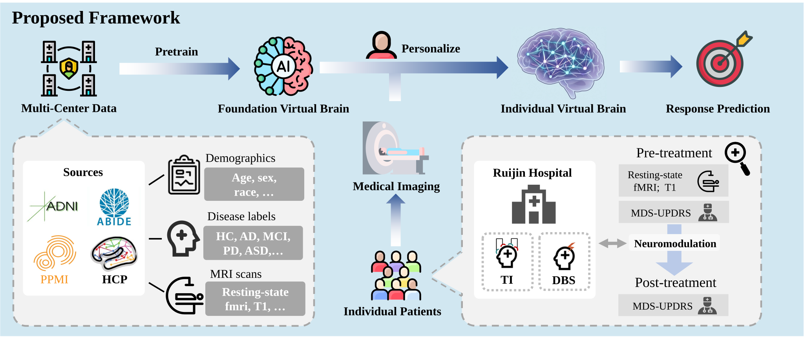
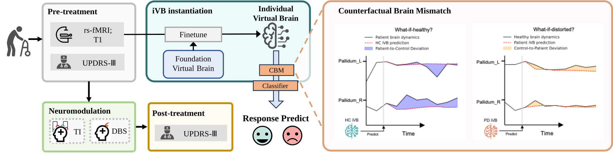

# Predicting Neuromodulation Outcome for Parkinson’s Disease with Generative Virtual Brain Model

Code implementation for the paper "Predicting Neuromodulation Outcome for Parkinson’s Disease with Generative Virtual Brain Model".

## 📖 Overview

This repository contains the source code, pre-trained models, and data processing pipelines described in our work. Our proposed framework leverages generative modeling to bridge the gap between large-scale neuroimaging data and limited clinical samples, enabling precise prediction of neuromodulation outcomes.

#### 1. Framework Overview
Overview of the proposed framework: a generative virtual brain paradigm transfers dynamical priors from large-scale data to small clinical cohorts for individualized neuromodulation response prediction.



#### 2. Model Architecture
Architecture of the generative virtual brain model.


#### 3. Workflow & Counterfactual Analysis
Schematic illustration of the iVB-based workflow for predicting neuromodulation response and diagram depicting the calculation of the Counterfactual Brain Mismatch.



## 🛠 Installation

To set up the environment, please follow these steps:

1. Clone this repository:
   ```bash
   git clone git@github.com:desomeboy/Foundation-Individual-Generative-Virtual-Brain.git
   cd FVB2iVB
   ```